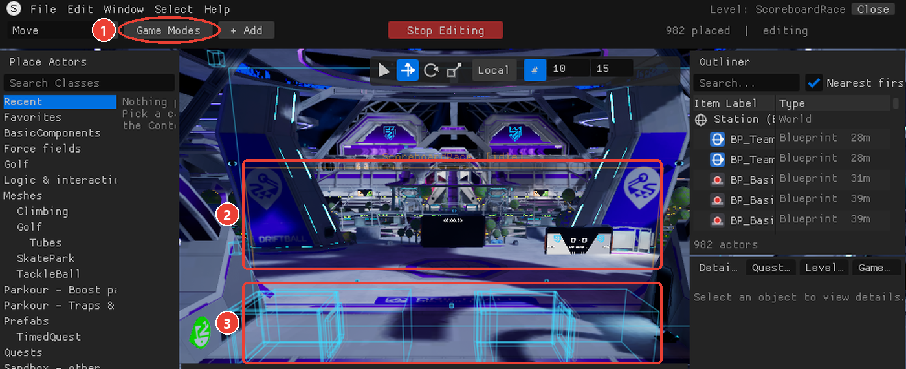
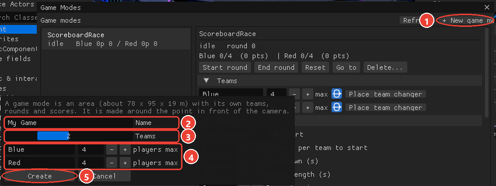
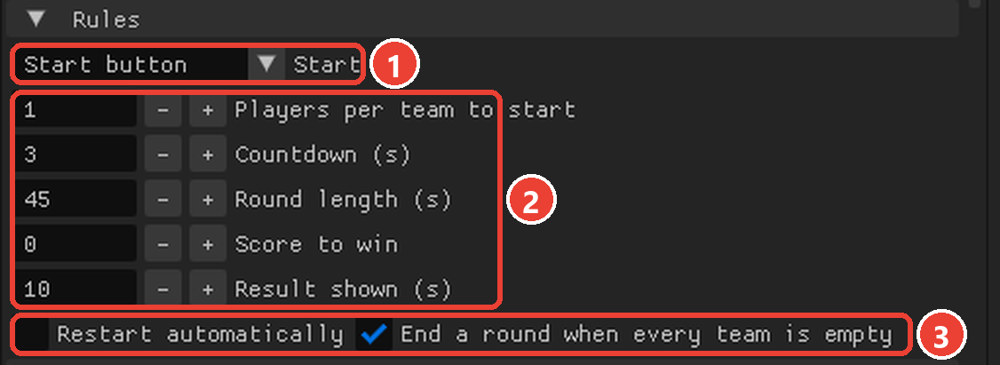
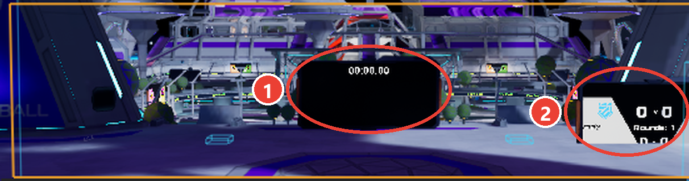
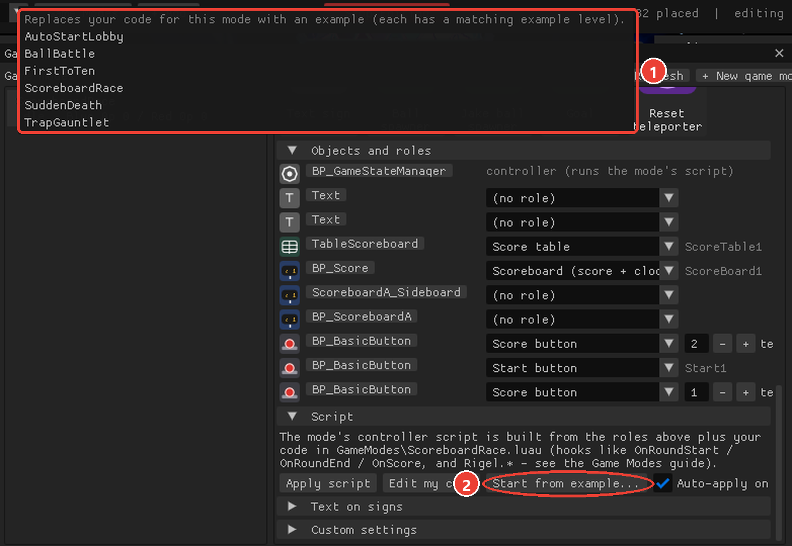
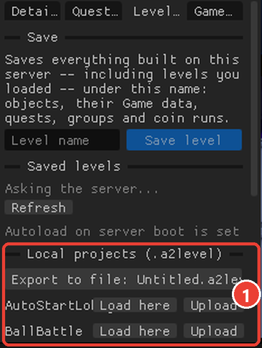

# Rigel Game Modes Guide

## What a game mode is

A **game mode** is an area of the station with its own **teams, rounds and scores**. You build one in the Spec
Editor, fill it with pieces -- team changers, start and score buttons, traps, force fields, timers, ball spawners,
scoreboards, text signs -- and the server runs it for everyone, Quest players included, with no mods on their side.

- Players pick a team by walking into one of the mode's **team changers**.
- A round goes **idle -> countdown -> running -> ended -> idle**. The server counts the countdown and the round
  time, keeps the scores, decides the winner and tells every machine.
- Pieces get **roles** ("start button", "trap on during rounds", "ball spawner" ...). The editor turns the roles
  into the mode's **controller script** and wires everything for you.
- Your own Luau adds the rules only you can think of, through a handful of hooks and the `Rigel` library.
- Game modes are saved in your levels and come back exactly when a level loads.

## Opening the Game Modes window

Click **Game Modes** in the toolbar (next to **+ Add**), or open **Details > Game Modes** and click
**Open the Game Modes window**. The window can be moved and resized; your game modes are on the left, the one you
picked on the right. Every game mode also shows in the viewport as an orange box (green while a round runs) with
its name and state.

A level must be open to make a game mode (**Levels** tab, or Ctrl+S to save one).




## Making one

1. Fly to where the arena should be: a game mode is made around the point in front of the camera.
2. Click **+ New game mode**. Type a **name**, choose **1 to 4 teams**, name each team and set its **max players**.
3. Click **Create**. The orange box shows the area (about 78 x 95 x 19 m). Everything placed inside it belongs to
   the mode.



Two modes can't overlap. **Delete...** removes a mode and everything in it.

## Teams and team changers

For each team, **Place team changer** puts a team changer in front of the camera (the spot must be inside the box).
Walking into it puts a player on that team; the team's size and the max show in the window and on scoreboards.

- A team changer is a **door**: its middle is 1.5 m up, so the server stands it on the floor under the spot you
  pick, facing the way the camera looks (players walk through it in that direction).
- Mark the doors so players can find them. The examples frame each door in its team's colour (two cube posts
  just outside the 3.5 m opening and a beam over the top; nothing crosses the doorway) with a sign above it:
  `{<mode>.team1.name} team`.

- Rename a team or change its max right in the window (press Enter / click away to apply).
- Team changers only work inside a game mode. Placed anywhere else the server refuses them.
- If a player is standing exactly where you place (or move) a team changer, it appears next to them and moves into
  place as soon as they step off. A changer created on top of a player would crash their game.

## Rules

| Rule | Meaning |
|---|---|
| **Start** | *Manual* (the window's Start round, or a script), *Start button* (a button with the Start role), *Automatic* (when every team has enough players) |
| **Players per team to start** | for Automatic |
| **Countdown (s)** | seconds between "start" and the round beginning; 0 = straight away |
| **Round length (s)** | 0 = no time limit (the round ends by score or by a script) |
| **Score to win** | a team reaching it wins at once; 0 = no limit |
| **Result shown (s)** | how long the result stays before the lobby |
| **Restart automatically** | start the next round after the result |
| **End a round when every team is empty** | so an abandoned round doesn't run forever: once a round has had players on a team and they all leave. A round started with empty teams keeps running |
| **Ball back to its spawner after a goal** | a Goal / Score box point resets every ball (a kick-off) |
| **My code runs the arena** (`script_flow`) | your code runs the whole game: clock, arena state, start ring, goals and the ball. The generated script only declares the slots, keeps the scoreboards up to date and calls your hooks. This is how the station's own Jakeball script works; `SpecEditor/tests/minijakeball_flow.luau` is that script ported onto a mode's slots |



**Start round**, **End round** and **Reset** in the window control the mode by hand. **Go to** flies the camera
there.

## Pieces and roles

**Place pieces** shows every useful piece with its icon; clicking one places it inside the mode (in front of the
camera) and gives it its role straight away. **Objects and roles** lists everything in the mode with its icon;
change any object's role from its drop-down.


| Role | For | What it does |
|---|---|---|
| Start button | buttons | starts a round (when none is on) |
| Score button (team N) | buttons | +1 point for team N while a round runs |
| Trap - on during rounds | traps, sliding platforms | switched on when a round starts, off when it ends |
| Trap - pulses during rounds (seconds) | traps | flips on/off every N seconds while a round runs |
| Trap - fired by trap buttons | traps | switched on for a while when a trap button is pressed |
| Trap button (seconds) | buttons | fires every "fired by trap buttons" trap for N seconds |
| Wall - between rounds only | force fields, walls | solid between rounds, gone while a round runs |
| Wall - during rounds only | force fields, walls | only there while a round runs |

Force fields are switched on and off for the wall roles; any other piece is shown and hidden (and its collision
switched) instead -- the editor picks the right one for the object.
| Round timer | Timer | counts the countdown, then the round (or up, with no limit) |
| Ball spawner | Jake ball / ball spawners | the server spawns or resets its ball when a round starts |
| Goal (team N) | Driftball goal, Goal | the ball going in during a round gives team N the goal's points (1, more for long shots) |
| Score box (team N, 0 = by side) | Score box (a disc trigger) | the ball flies *through* it; each pass during a round gives team N a point. 0 = by side: along the box's forward arrow scores for team 1, the other way for team 2 |
| Ball start ring | Ball start ring | between rounds, carry the ball into it to start a round; hidden while a round is on |
| Goal celebration (team N) | Goal celebration VFX (`LE_BP_VFX_TackleBallGoal01a_C`) | off until your code switches it on when team N scores. Its slot is named after the team: `Celebrate1`, `Celebrate2` |
| Midfield trigger | a disc trigger (`BP_DiscTriggerC_C`) | for your code: the ball crossing it (e.g. ends Jakeball's next-point countdown early). Slots `Midfield1`, `Midfield2`, ... |
| Scoreboard (score + clock) | the classic Score board | shows team 1 / team 2 points |
| Score table | the Score table | one row per team: name, score, players, rounds won |

After changing roles click **Apply script** (or keep **Auto-apply on save** on and just save your code).

### Scoreboards

- **Scoreboard monitors** (and the side / half-court versions) need no role: the mode keeps its team scores and
  rounds won on them, and drives their clock and the arena state. During the **countdown** the monitor shows the
  seconds counting down while the round clock waits at the full round length;
  when the round starts it switches to the clock and the scores.
- A monitor shows its game page only once someone is on a team; with every team empty it shows the empty-arena page.
- A monitor finds its mode when the **level loads**. After adding monitors, save the level, close it and open it
  again; until then they read "Inactive" or stay dark.
- A monitor's screen faces its local Y (the side its stand leans away from): check it from inside the arena.
- The classic **Score board** shows team 1 and team 2 points (role *Scoreboard*).
- The **Score table** shows a row per team (role *Score table*).
- A **Text sign** can show anything the mode knows through templates (below).



### Balls, goals and the start ring (driftball)

Jake ball spawners (and the other ball spawners) spawn a real, networked ball on the server that every player
sees. Give the spawner the **Ball spawner** role: the server spawns or resets the ball when each round starts, and
`Rigel.resetBalls()` does it whenever your code asks (after a goal, say). Don't spawn balls from Luau: the script
runs on every machine and each would make its own ball that only it can see.

**Moving and sizing a ball.** A ball is made at run time, so what you really place is its spawner. The editor lists
the balls of your spawners (*Ball (edits its spawner)*) and you can pick and drag them like anything else: the
spawner moves by as much as you moved the ball, and the ball follows. Moving the spawner itself does the same.
Balls the station owns (training balls, death balls) are not listed.

- **Resize a ball** by scaling the ball (not the spawner): the game sizes a spawner's ball at 1 / the spawner's
  scale on every machine, so a ball scaled to 2 sets its spawner to 0.5. Sizes 0.25 to 4 work; the ball keeps its
  size through rounds and moves, rests on the floor at its new size, and plays normally.
- **Rotating a ball** changes nothing: a ball's rotation is its physics (it rolls).
- Any edit to a spawner (move, scale, turn) rebuilds it, and it makes a fresh ball -- the old one is replaced, not
  lost. Scaling the *spawner* resizes its ball the other way round (a big spawner makes a small ball).
- After such an edit the editor wires the mode's script again by itself, so the ring and goals keep knowing the ball.
- One ball per mode: check the area for other ball spawners (the station's training spawners count) before you add one.

- **Goals.** Place a *Driftball goal* from the pieces (or give any goal the **Goal** role) and set the team that
  scores there. The game's own goal detection fires, the mode adds the goal's points to that team, and -- with
  *Ball back to its spawner after a goal* on (the default) -- every ball goes back to its spawner for a kick-off.
  The goal takes the colour of the team defending it.
- **Score boxes.** A *Score box* is a trigger the ball passes through (it doesn't bounce off). Give it a team, or
  **0 = by side**: the direction the ball crosses decides the team (along the box's forward arrow = team 1, the
  other way = team 2) -- rotate the box so its arrow points at team 2's end. Scale it to the gap you want to guard.
- **Start ring.** With a *Ball start ring* the mode keeps its ball out between rounds; a player carries it into the
  ring to start the round, like the station's arenas. The first 3 seconds after a round ends don't count (the ball
  is being put back), so a ring next to the spawner is fine. The ring hides while a round runs.
- A goal or box counts once even though every machine sees it (the server ignores repeats of the same goal within
  2.5 s), and only while a round is running. In your own code, `Rigel.goal(team, points, key)` does the same.
- **Which team a goal is for, in your own code.** Every goal slot comes with a constant: `Goal1_team` is the team
  that scores in `Goal1`. Use it in `Goal1.onGoalScored.Listen(...)`; don't rely on the game's `goalInfo.scoringTeam`,
  which reads the same for both goals of a mode.
- **Players on a ball mode's teams are seated in its ball simulation** (as in the station's Jakeball arenas: that's
  what makes the ball respond to them). When the ball is about to go, the server takes those players off the teams
  first and waits about 1.5 s: closing, re-opening or unloading the level, deleting the mode, moving or deleting its
  ball spawner. Otherwise their game would crash. They walk back in through a team door afterwards.
- **A player joining** while a mode has players on its teams gets the teams a few seconds after the rest of the
  arena. For those ~12 s the team boards show empty for everyone. This stops the joining player from crashing.

## Text on signs

Put a Text object in the mode and give it a text with `{templates}`. They update live for everyone. For a mode
called **Arena**:

`{Arena.state}` `{Arena.time}` `{Arena.round}` `{Arena.winner}` `{Arena.players}` `{Arena.team1.name}`
`{Arena.team1.score}` `{Arena.team1.size}` `{Arena.team1.max}` `{Arena.team1.wins}` (and team2, ...)

The window's **Text on signs** section lists them with a copy button. Your code can add its own:
`Rigel.setText("Leader", "Blue lead!")` fills `{Leader}`.

## Your own code

Click **Edit my code** to open `Documents\RigelScripts\GameModes\<mode name>.luau` in VS Code (a template is made the
first time), or **Start from example...** to begin from one of the examples. The editor puts your code into the
mode's controller script together with the roles; **Show generated** shows the whole thing.



Don't write `BeginPlay` -- write any of these hooks:

```lua
function OnLobby() end                               -- no round on
function OnCountdown(seconds: number) end            -- a round is about to start
function OnRoundStart(round: number) end             -- round = 1, 2, ...
function OnRoundEnd(winner: number) end              -- winner = team number, 0 = draw
function OnTeamChanged(team: number, size: number, old: number) end
function OnScore(team: number, score: number, old: number) end
function OnTime(secondsLeft: number) end             -- every second of a countdown or round
```

Objects with roles are available by their slot names (shown next to each object in the window): `Start1`,
`Score1`, `TrapRound1`, `TrapFired2`, `Timer1`, `Ball1`, `ScoreBoard1`, ...

### The Rigel library

| Read | |
|---|---|
| `Rigel.state()` | `"idle"`, `"countdown"`, `"running"`, `"ended"` |
| `Rigel.isRunning()`, `Rigel.round()`, `Rigel.timeLeft()` | round state; seconds left |
| `Rigel.teams()`, `Rigel.teamName(t)`, `Rigel.teamSize(t)`, `Rigel.teamMax(t)` | teams are numbered from 1 |
| `Rigel.score(t)`, `Rigel.roundsWon(t)`, `Rigel.players()`, `Rigel.winner()` | |
| `Rigel.setting("round_time")`, `Rigel.settingNumber(k)` | the rules, and your **Custom settings** |

| Do | |
|---|---|
| `Rigel.startRound()`, `Rigel.startNow()` | with / without the countdown |
| `Rigel.endRound(winner?)` | a team number, or nothing to decide by score |
| `Rigel.resetGame()` | scores and rounds back to zero |
| `Rigel.addScore(team, n?)`, `Rigel.setScore(team, n)` | points count only during a round |
| `Rigel.goal(team, n?, key?)` | a goal: counted once per `key` per 2.5 s, then balls reset (rule *Ball back to its spawner*) |
| `Rigel.setCustom(key, value)`, `Rigel.setText(name, value)`, `Rigel.resetBalls()` | |

Scripts run on every machine; the Rigel actions only take effect on the server, so it's safe that every machine
calls them. `Rigel.onStateChanged(f)`, `onTeamChanged(f)`, `onScoreChanged(f)`, `onTimeChanged(f)` are the callbacks
behind the hooks -- use them from any other script in the mode too.

## The examples

Each example comes as a **level** (Levels tab, *Local projects*) with the arena built -- team changers, buttons,
traps, scoreboards, signs -- and as code (**Start from example...**):



| Level | What it shows |
|---|---|
| **FirstToTen** | a score race with a live "who leads" sign, start + score buttons, a scoreboard monitor and a Score board |
| **AutoStartLobby** | a lobby that counts players in and starts by itself, a force field that opens for the round, a timer |
| **SuddenDeath** | a timed round; a draw goes into a 30-second sudden death; a Score table |
| **TrapGauntlet** | traps fired by a trap button, a pulsing laser, a spinner on during rounds, all fired for the last 20 s |
| **BallBattle** | a Jake ball match: first to 5, the ball resets after every point |
| **ScoreboardRace** | every kind of scoreboard and a catch-up rule for the last 15 seconds |

## Troubleshooting

- **"Team changers only work inside a game mode"**: place them inside the orange box.
- **The round ends by itself**: *End a round when every team is empty* is on and everyone who was on a team left.
- **A button does nothing**: check its role in *Objects and roles*, then **Apply script**. Score buttons only count
  during a round.
- **My code doesn't run**: the Problems popup shows script errors; the game log shows `[GM_<mode>.luau]` lines.
  Use the checker in VS Code (the kit's *Rigel checks*), and never write `BeginPlay` in mode code.
- **The ball doesn't come back**: give the spawner the *Ball spawner* role and call `Rigel.resetBalls()`.
- **The monitor shows no countdown**: set *Countdown (s)* above 0 and put someone on a team (an empty arena shows
  its empty page). Levels saved before 2026-09-24 need **Apply script** once to pick up the countdown fix.
- **The ball is the wrong size**: its size is 1 / its spawner's scale. Scale the ball itself (not the spawner) to
  the size you want, or set the spawner back to 1.
- **The ring doesn't start the round**: someone must be on a team, it must be at least 3 s after the last round
  ended, and the ball must be the mode's own (the *Ball spawner* role).
- **Cubes don't meet**: the cube prefabs aren't all the same size at scale 1 -- the navy gridded cube is 1 m, the
  purple gridded cube 0.64 m. Size each by what it really covers. Use only the two gridded cubes for walls; the
  small / blue / yellow cube primitives disappear at some distances.
- **The monitor is dark or "Inactive"**: save, close and reopen the level (monitors find their mode at load).

## Building game modes with an AI agent

The editor has an MCP server (`RigelScripts\mcp\rigel_mcp.py`) that lets an AI agent such as Claude or Codex build
game modes, place objects and write, check and fix Luau for you. See **Rigel-MCP-Guide.pdf**.
